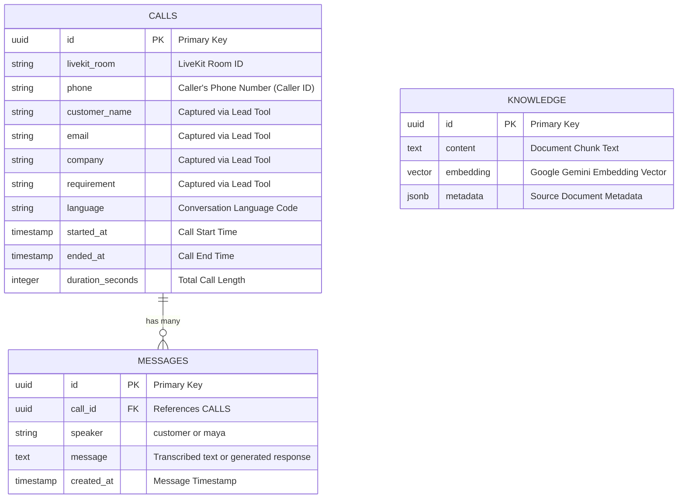
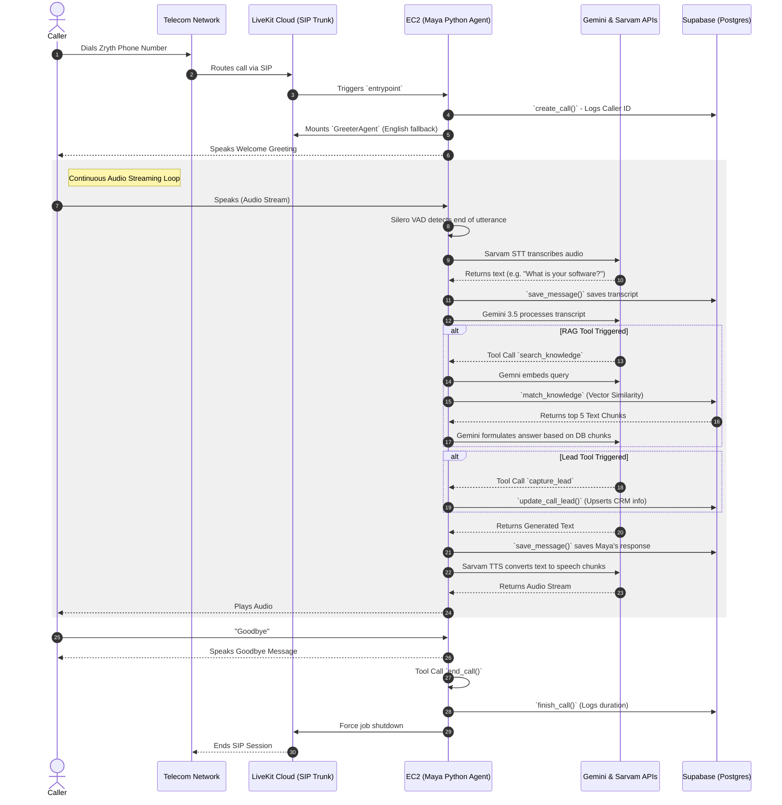

# Zryth Voice Agent System Architecture

## 1. Database Architecture (Supabase PostgreSQL)

The system relies on a Supabase PostgreSQL backend, utilizing standard relational tables for logging and `pgvector` for semantic search.

### Database Features
- **Call State Management:** A unique row is inserted into `CALLS` upon connection. Tools incrementally `UPDATE` this row as they capture lead requirements.
- **Transcripts:** Every transcription chunk and LLM output is asynchronously appended to the `MESSAGES` table for full historical recall on the dashboard.
- **Knowledge Base (RAG):** The `KNOWLEDGE` table utilizes the `pgvector` extension. A custom PostgreSQL RPC function (`match_knowledge`) performs cosine similarity comparisons against the caller's embedded search query to retrieve the closest text chunks.

---

## 2. Tools & Integrations Architecture

The system uses a best-in-class cascaded pipeline designed for extremely low latency (Time-to-First-Byte) and human-like interactions in Indian contexts.

### Component Integrations
- **Core Orchestration:** **LiveKit Agents Framework** runs the core async Python loop, managing WebRTC streams and session states.
- **Telephony (SIP):** **LiveKit SIP Trunk** handles routing standard inbound phone calls into WebRTC rooms, and dialing out to human agents (`transfer_to_human` tool).
- **Voice Activity Detection (VAD):** **Silero VAD** (running locally). This is tuned heavily to filter background noise while still capturing snappy human interruptions.
- **Speech-to-Text (STT):** **Sarvam Saaras STT**. Chosen for its native understanding of English-Indic code-mixing (speaking English words amidst Hindi/Telugu sentences).
- **LLM (The Brain):** **Google Gemini 3.5 Flash**. Chosen for its incredibly fast inference speeds (TTFT) which is vital for voice agents. It routes prompts, processes context, and handles tool invocations.
- **Embeddings:** **Google Gemini (gemini-embedding-2)**. Generates semantic vectors for incoming RAG queries.
- **Text-to-Speech (TTS):** **Sarvam Bulbul TTS**. Generates ultra-realistic Indian-accented speech that streams directly back into the LiveKit pipeline.

---

## 3. System Flow Diagram

The following diagram maps the lifecycle of a phone call from the moment the user dials in, to how Maya processes audio and executes backend tools.

