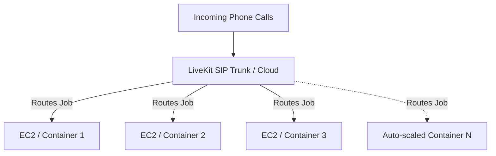

# Deployment & Scalability Strategy

When deploying a real-time Voice AI agent using LiveKit, the infrastructure requirements are fundamentally different from traditional web APIs. Because voice agents require persistent, low-latency WebRTC connections, standard scaling models like serverless functions do not work. 

Here is the breakdown of deployment requirements and how to build a highly scalable architecture.

## 1. Why Serverless Functions (AWS Lambda, Vercel) DO NOT Work

You might assume that moving the agent to AWS Lambda or Google Cloud Functions would make it infinitely scalable and optimized. **This is a dangerous misconception for Voice AI.**

> [!CAUTION]
> **Do not use Serverless Functions for LiveKit Agents.**
> Real-time voice agents stream raw audio bi-directionally over WebRTC. This requires a persistent, long-running stateful connection (often lasting 5 to 30 minutes). 
> Serverless functions are completely stateless, terminate execution arbitrarily, and do not support long-lived WebRTC/WebSocket streaming connections. Using them will result in immediately dropped calls and connection timeouts.

## 2. Deployment Requirements

To deploy `agent.py` successfully, you must use a traditional server environment that supports long-running processes:

- **Compute:** A standard Virtual Private Server (VPS), AWS EC2, DigitalOcean Droplet, or Container (Docker/Kubernetes).
- **Minimum Specs:** 2 vCPUs and 4GB RAM is the absolute minimum for testing. For production, 4 vCPUs and 8GB RAM is recommended to handle concurrent audio encoding/decoding.
- **Process Manager:** You must use a process manager like `systemd` (which you are currently using) or `pm2` to keep the agent running continuously and restart it if it crashes.
- **Network:** Outbound internet access to connect to LiveKit Cloud (wss://), Gemini, and Sarvam APIs. Port 5060 for SIP traffic is handled by LiveKit Cloud, so your local server does not need complex firewall port-forwarding.

## 3. How to Make It Massively Scalable

The LiveKit Agents framework is brilliantly designed for horizontal scalability out-of-the-box. You do not need to write custom load-balancers or queuing systems.

### The "Worker" Architecture
When you run `python agent.py start`, you are starting a **Worker**. 
LiveKit Cloud acts as the central router. When 100 people call your phone number simultaneously, LiveKit looks for available Workers to route the calls to.

### Steps to Scale (Horizontal Scaling)

To go from handling 10 concurrent calls to 10,000 concurrent calls, follow this architecture:

1. **Dockerize the Application:** Wrap your `agent.py` script and its dependencies in a Docker container.
2. **Deploy to a Container Orchestrator:** Use AWS ECS (Fargate) or Kubernetes (EKS). 
3. **Spin up Multiple Instances:** Deploy 50 identical containers running your `agent.py` script. 
4. **Automatic Load Balancing:** All 50 containers will connect to your LiveKit Cloud URL using the same API Key. LiveKit will automatically pool them together. When calls come in, LiveKit will instantly distribute the jobs across all 50 containers, completely abstracting the load balancing away from you!
5. **Auto-scaling Rules:** Set up AWS ECS/Kubernetes to automatically launch more containers if the CPU utilization across your cluster exceeds 70%. 

